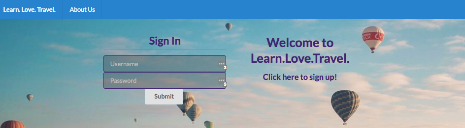

# Learn.Love.Travel.
A travel planning app for multiple cities with top attraction information. Ruby on Rails back end, JavaScript/React front end with Google Maps and Yelp APIs, Bcrypt and JSON Web Tokens. 

[Learn.Love.Travel. Demo](https://www.youtube.com/watch?v=tlp6Bd8HyX4)

## How To Use
* View the Travel Map and select a city for more information.
* All cities have top attraction information and a comments section.
* You can read comments about a city and write some of your own.
* Plan a trip to a city on specific dates and write notes about your future trip.

## Prerequisites

* Ruby v5.1.4
* PostgreSQL 10
* React

## Install
1. Fork and clone this repo - https://github.com/brianabaker/love-travel.
2. Navigate to love-travel-backend, complete backend setup.
3. In a separate terminal window, navigate to love-travel-frontend, complete frontend setup.

## Backend Setup
After navigating to love-travel-backend, in that directory: 
1. Install Gems `bundle install`
2. Setup Database `rake db:setup`
3. Seed Database `rake db:seed`
4. Start your server `rails s`

## Frontend Setup
After navigating to love-travel-frontend, in that directory: 
1. Install dependencies `npm install` 
2. Start your server `npm start` 

## In Your Browser 
Navigate to the web address of your Node server [http://localhost:3001](http://localhost:3001) - or whatever yours is

## Contributors 
* [Briana Baker](https://github.com/brianabaker)
* [Lindsay Criswell](https://github.com/lindsaycriswell)
